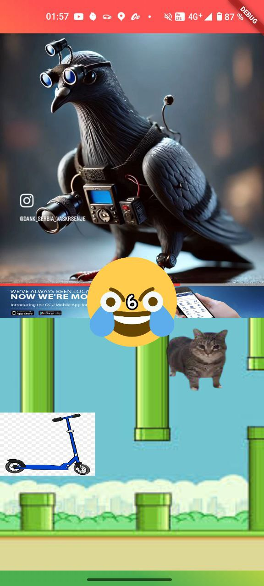
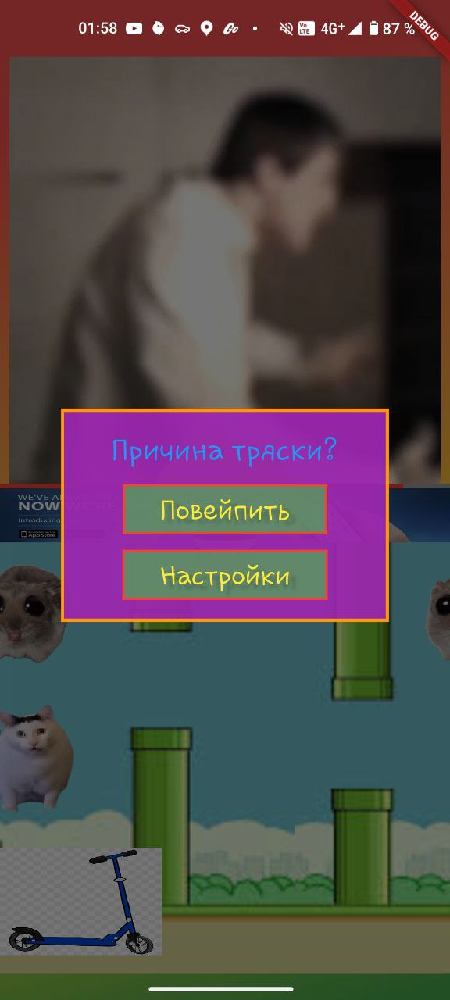
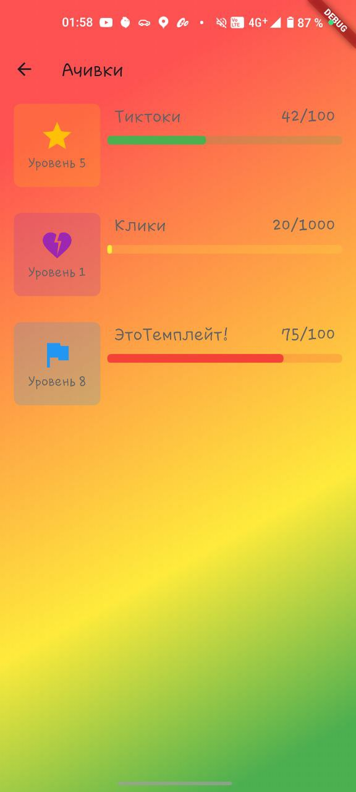
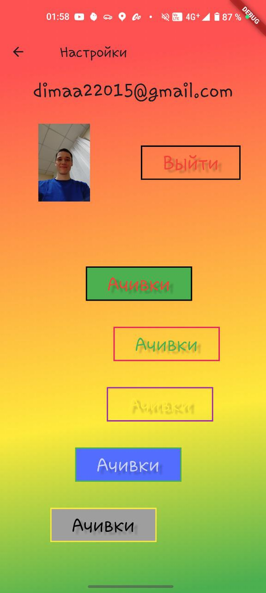

# SDVGO aka super-app для зумеров 🚀

## 📑 Содержание

- [🎯 Обзор проекта](#-обзор-проекта)
- [🖼️ Скриншоты](#-скриншоты)
- [🎥 Видео демонстрации](#-видео-демонстрации)
- [🏗 Архитектура](#-архитектура)
- [📱 Версии и требования](#-версии-и-требования)
- [🌐 Сетевые сервисы и API](#-сетевые-сервисы-и-api)
- [🛠 Технологии и инструменты](#-технологии-и-инструменты)
- [⚙️ Установка и настройка](#-установка-и-настройка)
- [🔥 Firebase настройка](#-firebase-настройка)

## 🎯 Обзор проекта

Flutter-приложение SDVGO aka super-app для зумеров. Мы решили объединить в себе возможность кастомизировать
под себя опыт, проведенный в телефоне. Смотреть тиктоки, которые разделены пополам сложно: вы не
можете никак изменить нижний блок с активностью, потому что это неизменяемое видео, точно так же и с
верхней частью. Это не круто. 

Поэтому мы сделали кастомизированные блоки - чтобы можно было выбирать
на что расфокусировать свое внимание. Их несколько снизу и несколько сверху. Тикток, Депрессивное
зеркало, Игра про самокаты, Бумерский переводчик и экстра блок при тряске - вэйп.
Внизу небольшое dev-info.

## 🖼️ Скриншоты

### Главный экран


### Главный экран + вэйп


### Действие вэйпа


### Диалог тряски


### Достижения


### Настройки


## 🎥 Видео демонстрации

### Демонстрация основных функций


## 🏗 Архитектура

Проект построен на принципах Clean Architecture:

- **Presentation Layer**: UI компоненты, виджеты, страницы
- **Domain Layer**: Бизнес-логика, сервисы, модели
- **Data Layer**: Репозитории, источники данных

Папки разделены на Feature-First; С CloudStorage подгружаются ссылки на видео и их метаданные, видео
хранятся в отдельном репозитории - его можно заменить на любой S3;

Подробнее о нашей архитектуре:

- [Статья про архитектуру](https://habr.com/ru/articles/733960/)

## 📱 Версии и требования

- **Flutter**: 3.29.2
- **Dart**: 3.7.2
- **Firebase**: ^10.8.0
- **Минимальная версия Android**: 5.0 (API 21)
- **Минимальная версия iOS**: 13.0

## 🌐 Сетевые сервисы и API

### Firebase Services
- **Firebase Authentication**: Управление пользователями
- **Cloud Firestore**: Хранение метаданных про тиктоки
- **Firebase Analytics**: Аналитика использования

### Внешние API
- **GitHubUserContents**: S3-хранилище для тиктоков
- **Proxy API(OpenAI)**: Сервис перевода для "Бумерского переводчика"

## 🛠 Технологии и инструменты

### Frontend
- **Flutter**: Основной фреймворк
- **Cubit/Bloc**: Управление состоянием
- **YX Scope**: Dependency Injection
- **Video Player**: Воспроизведение видео

### Backend
- **Firebase**: Бэкенд-инфраструктура
- **Cloud Functions**: Серверная логика
- **Cloud Storage**: Хранение файлов

### Инструменты разработки
- **Android Studio**: IDE
- **GitHub**: Контроль версий и CI/CD
- **FlutterFire CLI**: Инструменты Firebase
- **Firebase CLI**: Управление Firebase

## ⚙️ Установка и настройка

1. Клонирование репозитория
   ```bash
   git clone https://github.com/username/sdvgo.git
   cd sdvgo
   ```

2. Установка зависимостей
   ```bash
   flutter pub get
   ```

3. Настройка Firebase (см. раздел [Firebase настройка](#-firebase-настройка))

4. Запуск приложения
   ```bash
   flutter run
   ```
5. Можно использовать и кайфовать!

## 🔥 Firebase настройка

### Если вы сами поднимаете проект - то пропустите первый пункт и создайте проект в CloudConsole)

0. Получите доступ к проекту Firebase от @timtikh (администратор проекта)

1. Сгенерируйте Ключ подписания SHA-1 и передайте его в Project Settings или администратору проекта:

   ```bash
   keytool -list -v -keystore ~/.android/debug.keystore -alias androiddebugkey -storepass android -keypass android
   
   ```

2. Настройка Firebase для Android:
    - Скачайте файл `google-services.json`
      из [настроек проекта Firebase](https://console.firebase.google.com/project/sdvgo-8f8e5/settings/general/android:com.sirius.yandex.sdvgo?hl=ru)
    - Поместите файл в каталог `android/app/`

3. Настройка Firebase для iOS (если нужно, но у меня не заработало):
    - Скачайте файл `GoogleService-Info.plist` из настроек проекта Firebase
    - Поместите файл в каталог `ios/Runner/`

4. Установка Firebase CLI и FlutterFire:
   ```bash
   # Установка Firebase CLI (можно не через npm)
   npm install -g firebase-tools
   
   # Авторизация в Firebase
   firebase login
   
   # Установка FlutterFire CLI (macos: проверь добавился ли в zsh)
   dart pub global activate flutterfire_cli
   
   # Настройка Flutter проекта
   flutterfire configure --project=sdvgo-8f8e5
   # Соответсвенно если вы сами поднимаете: --project=<project-id>, не sdvgo
   # возможно попросит ввести com.example.app bundle - com.sirius.yandex.sdvgo
   ```

5. Перезапустите приложение:
   ```bash
   flutter clean
   flutter pub get
   flutter run
   ```
6. Cold Reboot эмуляторов
    - Вероятно, ничего не заработает, пока не перезапустите эмулятор - с Hardware-устройствами
      такого не наблюдалось.

